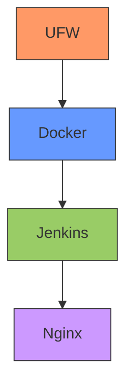

# Ansible Documentation Hub

Welcome to the Ansible documentation hub for the Whanos infrastructure. This guide provides comprehensive information about the Ansible setup, roles, and configuration.

## Quick Links

### [Playbook](playbook.md)

### [Roles](roles/roles-hub.md)

## Infrastructure Overview

The Whanos infrastructure is deployed using Ansible with four main components:



## Quick Reference

### Directory Structure
```
ansible/
├── collections/
├── group_vars/
├── roles/
│   ├── docker/
│   ├── jenkins/
│   ├── nginx/
│   └── ufw/
├── inventory.yml
└── playbook.yml
```

### Common Commands
```bash
# Basic deployment
make run

# Verbose deployment
make run-verbose

# Debug mode deployment
make run-very-verbose
```

### Configuration Files
- `group_vars/all.yml` - Main configuration variables
- `inventory.yml` - Server inventory
- `playbook.yml` - Main playbook
- Role-specific configurations in respective role directories

## Role Dependencies

1. **UFW** (First)
   - Basic security layer
   - Port management

2. **Docker** (Second)
   - Container runtime
   - Required by Jenkins

3. **Jenkins** (Third)
   - CI/CD server
   - Requires Docker

4. **Nginx** (Fourth)
   - Reverse proxy
   - Requires Jenkins

## Security Notes

- UFW firewall is configured first
- Only essential ports (22, 80) are opened
- Jenkins is accessed through Nginx reverse proxy
- Docker security is properly configured
- All services run with appropriate permissions

## Additional Resources

- [Ansible Official Documentation](https://docs.ansible.com/)
- [Jenkins Documentation](https://www.jenkins.io/doc/)
- [Docker Documentation](https://docs.docker.com/)
- [Nginx Documentation](https://nginx.org/en/docs/)

## Continue with:

### [Playbook](playbook.md)

### [Roles](roles/roles-hub.md)

## Or go back to:

### [Documentation Hub](../documentation-hub.md)